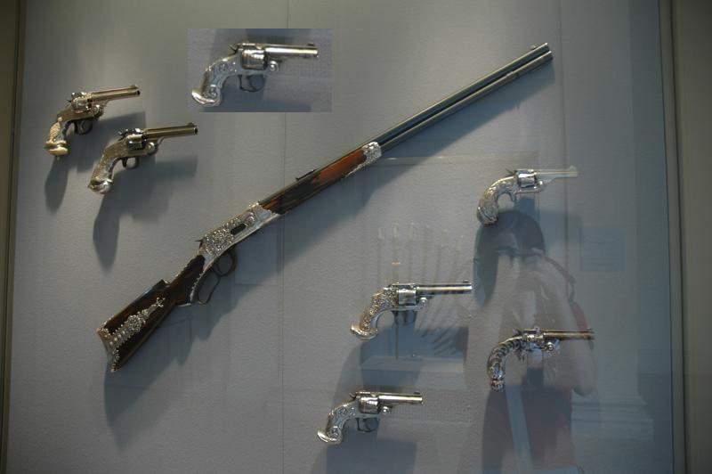
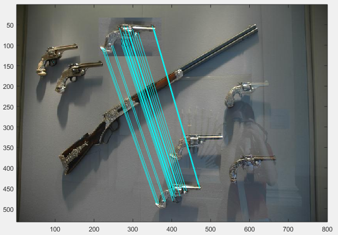

# Copy-Move 的一种简单实现

**鉴于目前偶有网友发邮件索取代码，现在准备把2016年初在校时做的一个小项目进行开源，除此之外暂无其它任何改进，后续大概率也不会再更新，目前在*Win10+MATLAB 2020a*环境测试没有发现问题，详细介绍见[这里](https://blog.csdn.net/jnulzl/article/details/50708886)**

---------------------------------------

**强烈推荐[原作者的实现](https://github.com/lambertoballan/sift-forensic)(以下内容可选择性阅读)**

## Demo

```matlab
%%original copy-move image
b = imread('DSC_0812tamp25.jpg');
imshow(b);
```



```matlab
%% copy-move
copyMoveDetection('DSC_0812tamp25.jpg');
```



# Citation

如果你认为本仓库对你的研究有帮助的话，请引用原文：

```shell
@article{2011A,
  title={A SIFT-based forensic method for copy-move attack detection and transformation recovery},
  author={ Amerini, I.  and  Ballan, L.  and  Caldelli, R.  and  Bimbo, A. D.  and  Serra, G. },
  journal={IEEE Transactions on Information Forensics and Security},
  year={2011},
}
```
